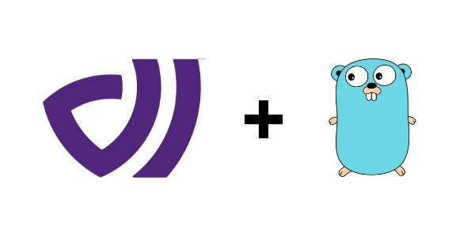

# DataArt Go Client

DataArt platform client for Golang.

<p>
    
</p>

## Getting Started

```bash
  $ go get -u github.com/dataart-ai/dataart-go
```

## Usage

Client instance requires a set of configurations passed by the `dataart.ClientConfig` object. You can start sending requests if no errors were returned in the initialization process. When starting a client instance keep these in mind:

- No internal singleton pattern is developed by the `dataart` package. It's up to you to manage your running instances.
- Don't forget to call `client.Close()` at exit to cleanup any remaining resources.

```go
cfg := dataart.ClientConfig{
	APIKey:                "your-api-key",
	FlushBufferSize:       100,
	FlushNumWorkers:       16,
	FlushNumRetries:       3,
	FlushBackoffRatio:     5,
	FlushActionsBatchSize: 20,
	FlushInterval:         time.Duration(5 * time.Second),
	HTTPClient:            http.DefaultClient,
}

c, err := dataart.NewClient(cfg)
if err != nil {
	// Something went wrong in the initialization process.
    return
}
defer c.Close()

// You can start using the client.
```

### Emit Action

```go
err := c.EmitAction("some-event-key", "some-user-key", false, time.Now(), map[string]interface{}{
	"metadata_key_1": "metadata_value_1",
	"metadata_key_2": 2,
})

if err != nil {
	// Error handling...
}
```

### Identify

```go
err := c.Identify("some-user-key", map[string]interface{}{
	"metadata_key_3": "metadata_value_3",
	"metadata_key_4": 4,
})

if err != nil {
	// Error handling...
}
```

## Full Example

```go
package main

import (
	"net/http"
	"time"

	"github.com/dataart-ai/dataart-go/pkg/dataart"
)

func main() {
	cfg := dataart.ClientConfig{
		APIKey:                "your-api-key",
		FlushBufferSize:       100,
		FlushNumWorkers:       16,
		FlushNumRetries:       3,
		FlushBackoffRatio:     5,
		FlushActionsBatchSize: 20,
		FlushInterval:         time.Duration(5 * time.Second),
		HTTPClient:            http.DefaultClient,
	}

	c, err := dataart.NewClient(cfg)
	if err != nil {
		// Error handling...
		return
	}
	defer c.Close()

	err = c.EmitAction("some-event-key", "some-user-key", false, time.Now(), map[string]interface{}{
		"metadata_key_1": "metadata_value_1",
		"metadata_key_2": 2,
	})
	if err != nil {
		// Error handling...
		return
	}

	err = c.Identify("some-user-key", map[string]interface{}{
		"metadata_key_3": "metadata_value_3",
		"metadata_key_4": 4,
	})
	if err != nil {
		// Error handling...
		return
	}
}
```

## Integration Testing

You can easily mock `dataart.Client` behaviour by providing a mock `dataart.Tracker` instance to it.

```go
package main

import (
	"time"

	"github.com/dataart-ai/dataart-go/pkg/dataart"
)

type mockDataArtTracker struct{}

func (m *mockDataArtTracker) EmitAction(key string, userKey string, isAnonymousUser bool,
	timestamp time.Time, metadata map[string]interface{}) error {

	return nil
}

func (m *mockDataArtTracker) Identify(userKey string, metadata map[string]interface{}) error {
	return nil
}

func (m *mockDataArtTracker) Close() {}

func thisFunctionRequiresClient(c *dataart.Client) {
	// Do something with client instance...
}

func main() {
	c := &dataart.Client{
		Config:  dataart.ClientConfig{},
		Tracker: &mockDataArtTracker{},
	}

	thisFunctionRequiresClient(c)
}
```

## Benchmark

The following benchmark is for emitting 4000 actions in parallel goroutines to the client:

```bash
goos: darwin
goarch: amd64
pkg: github.com/dataart-ai/dataart-go/pkg/dataart
cpu: Intel(R) Core(TM) i7-7700HQ CPU @ 2.80GHz

BenchmarkClient

BenchmarkClient             4000              5334 ns/op            1037 B/op          7 allocs/op
BenchmarkClient-2           4000              3066 ns/op            1116 B/op          9 allocs/op
BenchmarkClient-4           4000              3908 ns/op            1190 B/op          9 allocs/op
BenchmarkClient-8           4000              4655 ns/op            1253 B/op          9 allocs/op
PASS
```

**Benchmark System:**

- Intel(R) Core(TM) i7-7700HQ CPU @ 2.80GHz
- 2x 8 GiB LPDDR3 2133 MHz RAM
- go version go1.16.3 darwin/amd64
- MacOS 10.15.7

**Client Configuration:**

| FlushBufferSize | FlushNumWorkers | FlushNumRetries | FlushBackoffRatio | FlushActionsBatchSize | FlushInterval |
| --------------- | --------------- | --------------- | ----------------- | --------------------- | ------------- |
| 100             | 16              | 3               | 5                 | 20                    | 5s            |

## License

MIT License

Copyright (c) 2021 DataArt

Permission is hereby granted, free of charge, to any person obtaining a copy
of this software and associated documentation files (the "Software"), to deal
in the Software without restriction, including without limitation the rights
to use, copy, modify, merge, publish, distribute, sublicense, and/or sell
copies of the Software, and to permit persons to whom the Software is
furnished to do so, subject to the following conditions:

The above copyright notice and this permission notice shall be included in all
copies or substantial portions of the Software.

THE SOFTWARE IS PROVIDED "AS IS", WITHOUT WARRANTY OF ANY KIND, EXPRESS OR
IMPLIED, INCLUDING BUT NOT LIMITED TO THE WARRANTIES OF MERCHANTABILITY,
FITNESS FOR A PARTICULAR PURPOSE AND NONINFRINGEMENT. IN NO EVENT SHALL THE
AUTHORS OR COPYRIGHT HOLDERS BE LIABLE FOR ANY CLAIM, DAMAGES OR OTHER
LIABILITY, WHETHER IN AN ACTION OF CONTRACT, TORT OR OTHERWISE, ARISING FROM,
OUT OF OR IN CONNECTION WITH THE SOFTWARE OR THE USE OR OTHER DEALINGS IN THE
SOFTWARE.
